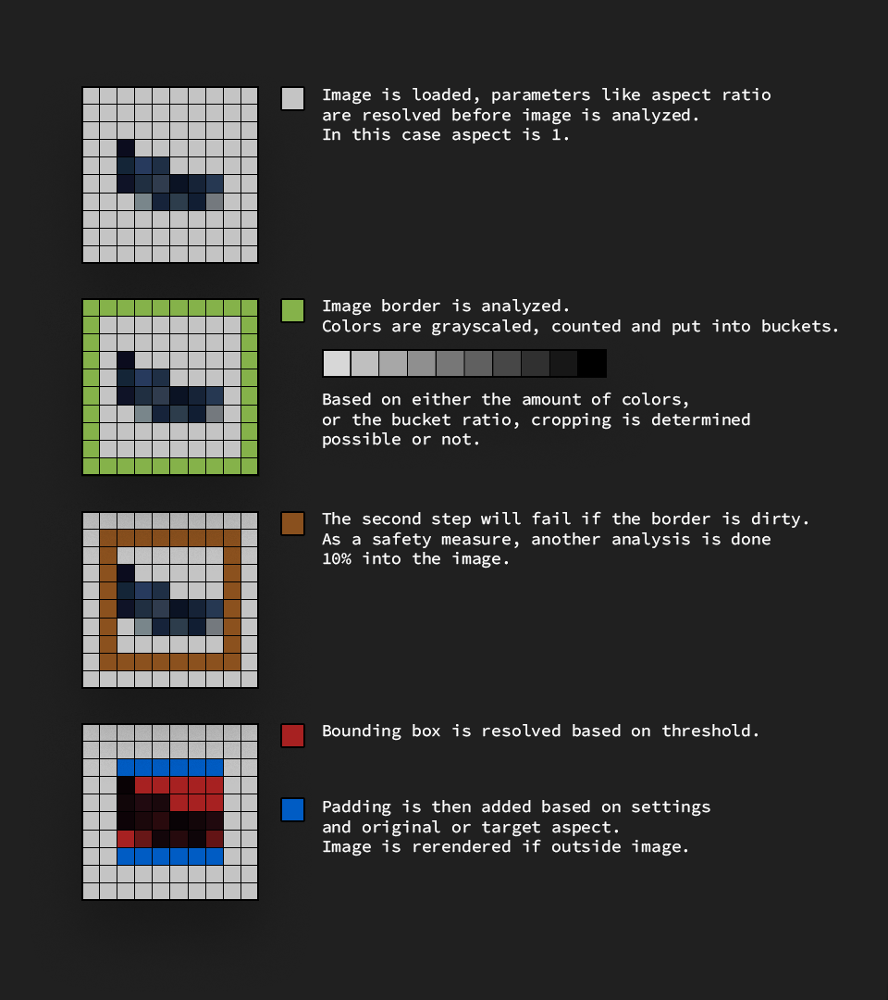

# ImageSharp.Processing.AutoCrop

## Description

Automatic cropping for images with a flat background.
Works with SixLabors.ImageSharp 1.0.0 and above.

Uses a relative luminance tolerance to determine which area to crop.

## Features

- Crops images with a flat background
- Configurable x and y padding
- Configurable treshold

## How to get started?

Requires SixLabors.ImageSharp 1.0.0 or above

- `install-package ImageSharp.Processing.AutoCrop`

The namespace `ImageSharp.Processing.AutoCrop.Extensions` contains some useful extensions to `SixLabors.ImageSharp.Processing.IImageProcessingContext`

```
using var image = Image.Load("image.png");

image.Mutate(ctx => ctx.AutoCrop());
```

Check the different overloads for some options.

## Details

The underlying `AutoCropProcessor` that will handle the actual cropping takes some parameters.

| Parameter | Description | Default value |
| --------- | ----------- | ------- |
| PadX | How much horizontal whitespace in percent (0-100) to apply outside the crop | 0 |
| PadY | How much vertical whitespace in percent (0-100) to apply outside the crop | 0 |
| ColorThreshold | Color divergence to tolerate from analyzed border color (0-255) | 35 |
| BucketThreshold | How many percent of the border that has to belong to the most present color bucket (0.0f-1.0f) | 0.945f |

## How it works


## Package maintainer

https://github.com/svenrog

## Changelog

[Changelog](CHANGELOG.md)